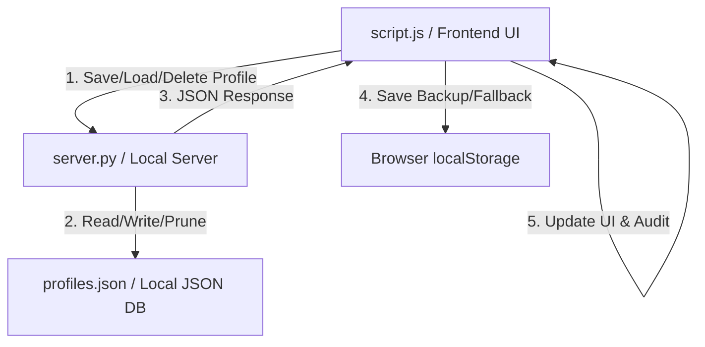

# GT Degree Planner (gt-scheduler)

A web-based tool for planning a 4-year degree schedule at Georgia Tech. It handles AP/DE credit mapping, interactive drag-and-drop scheduling, dynamic degree audits, course catalog imports, and year-by-year planning.

## Features
- **Flexible Schedule Storage:** Schedules are saved locally in the browser's `localStorage` and persist even when switching majors, allowing you to audit the same plan against different degree requirements.
- **Planner Profiles:** Create, load, overwrite, and delete multiple degree planning profiles. Each profile captures:
  - Selected Major
  - 4-Year Planned Schedule (semester courses)
  - AP Exam Scores
  - AP Credit Selection Paths
- **Suggested Plan Study Reset:** Instantly load or reset your semester grid layout to the official suggested study plan of study for your major (relocated inside the Utilities modal).
- **Dynamic Degree Audit:** Automatically audits completed/planned courses against major requirements, showing checkmarks for satisfied slots and listing unused courses.
- **Drag-and-Drop Scheduling:** Drag courses directly from the requirements checklist or catalog search results into semesters using [SortableJS](https://sortablejs.github.io/Sortable/).
- **AP / Dual Enrollment Credit Mapper:** An interactive side panel (`ap-credits.html`) allows you to input your AP scores and Dual Enrollment credits to automatically map them to Georgia Tech course codes.
- **Dynamic Course Catalog Fetcher:** A Python command-line utility (`update_courses.py`) downloads course details directly from the official Georgia Tech catalog and merges them into the local database.
- **Integrated Utilities Menu:** Exposes catalog fetching, profile management, and suggested plans directly inside the browser using a custom server. You can import any subject prefix (e.g. `CS`, `MATH`, `APPH`, `LCC`) and hot-reload the catalog database dynamically without refreshing the page.
- **Clean Responsive Styling:** Beautiful Georgia Tech themed design (Gold, Navy, and White) with collapsible requirement cards, exact course search placeholders, and full mobile-friendly layouts.

## Architecture & Data Flows

The project is structured to keep database updates and profile syncing decoupled and fast, with browser localStorage serving as a robust fallback for offline runs.



### 1. Database & Profile Layout
- **Course Catalog (`data.js`):** Unified database containing catalogs, AP mappings, and curriculum requirements.
- **Profile Data Format:**
  ```json
  {
    "name": "My Plan",
    "major": "neuroscience",
    "schedule": { "Fall 2026": ["MATH 1551", ...], ... },
    "apScores": { "Calculus BC": 5, ... },
    "apSelections": { "Calculus BC": "MATH 1551 & MATH 1552" }
  }
  ```

### 2. Profile Synchronization Flow
- **Dual Storage Strategy:** 
  - When the Python server is running, saving a profile sends a `POST` request to `/api/save-profile`, persisting it to a local `profiles.json` file in the project folder (this protects your plans from browser cache clears).
  - Simultaneously, a backup copy is saved to `localStorage` under `gt_planner_profiles`.
  - If the server is offline or not running (e.g., opening `index.html` as a file in the browser), the frontend seamlessly falls back to reading/writing from `localStorage` so the application remains 100% functional.
- **Indicator:** An active profile pill badge is displayed in the header controls (e.g., `Profile: Pre-Med Neuroscience`). Clicking this pill opens the utilities modal to the profiles panel immediately.

### 3. Server Endpoints (`server.py`)
- `GET /api/profiles`: Returns all profiles saved in `profiles.json`.
- `POST /api/save-profile`: Saves or overwrites a profile.
- `POST /api/delete-profile`: Deletes a profile from `profiles.json`.
- `GET /api/fetch-subject`: Runs catalog updater script.

### 4. Catalog Scraping Logic (`update_courses.py`)
- Scrapes the Georgia Tech courses pages (`https://catalog.gatech.edu/coursesaz/{subject_code}/`).
- Uses unverified SSL context to bypass macOS local Python root certificate validation errors.
- Syncs and prunes: matches description updates, logs additions, and deletes local database items if they are no longer in the catalog fetch (catalog is the source of truth). Exits with code `1` on error to prevent data loss.

## File Structure
- `index.html`: Main planner layout (checklist side pane, calendar grid, utilities modal, active profile indicator).
- `ap-credits.html`: AP Exam Score and Dual Enrollment credit configuration manager.
- `style.css`: Modern styling tokens, layout grids, animations, and profile list layout designs.
- `script.js`: Core planner state manager, Sortable drag-and-drop binding, dynamic stats formatter, and profile management event loop.
- `data.js`: Unified course database, AP equivalencies, and major curriculum requirements.
- `update_courses.py`: Scraping script that extracts course data from the GT catalog.
- `server.py`: Custom HTTP server that integrates the static front-end, catalog-scraping script, and profile storage endpoints.
- `profiles.json`: Git-ignored file-system database of planning profiles.
- `.gitignore`: Configured to ignore local `profiles.json` and Python temporary cache directories.
- `ANTIGRAVITY.md`: Project documentation and architecture guide.

## Running the Project
To start the degree planner locally:
```bash
python3 server.py 8085
```
Then open **[http://localhost:8085](http://localhost:8085)** in your web browser.

## Major Curriculums Supported
- **Biology (B.S.)**
- **Neuroscience (B.S.)**
- **Biomedical Engineering (B.S.)**
