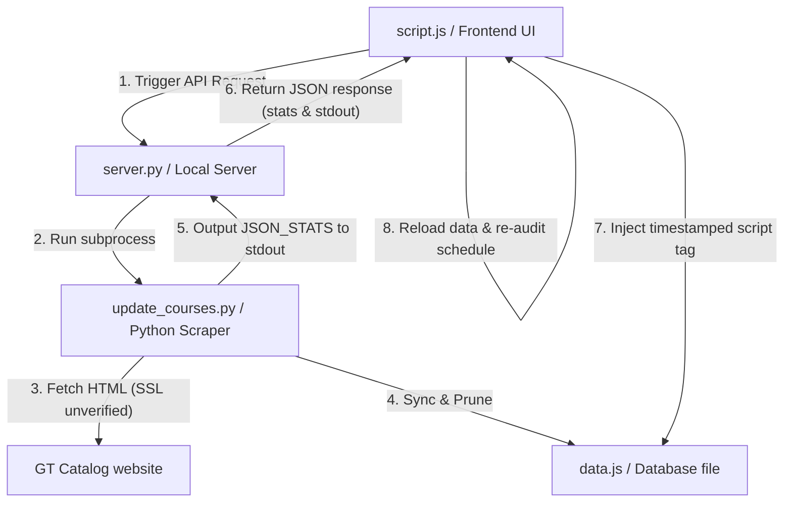

# GT Degree Planner (gt-scheduler)

A web-based tool for planning a 4-year degree schedule at Georgia Tech. It handles AP/DE credit mapping, interactive drag-and-drop scheduling, dynamic degree audits, course catalog imports, and year-by-year planning.

## Features
- **Flexible Schedule Storage:** Schedules are saved locally in the browser's `localStorage` and persist even when switching majors, allowing you to audit the same plan against different degree requirements.
- **Dynamic Degree Audit:** Automatically audits completed/planned courses against major requirements, showing checkmarks for satisfied slots and listing unused courses.
- **Drag-and-Drop Scheduling:** Drag courses directly from the requirements checklist or catalog search results into semesters using [SortableJS](https://sortablejs.github.io/Sortable/).
- **AP / Dual Enrollment Credit Mapper:** An interactive side panel (`ap-credits.html`) allows you to input your AP scores and Dual Enrollment credits to automatically map them to Georgia Tech course codes.
- **Dynamic Course Catalog Fetcher:** A Python command-line utility (`update_courses.py`) downloads course details directly from the official Georgia Tech catalog and merges them into the local database.
- **Integrated Utilities Menu:** Exposes catalog fetching directly inside the browser using a custom server. You can import any subject prefix (e.g. `CS`, `MATH`, `APPH`, `LCC`) and hot-reload the catalog database dynamically without refreshing the page.
- **Clean Responsive Styling:** Beautiful Georgia Tech themed design (Gold, Navy, and White) with collapsible requirement cards, exact course search placeholders, and full mobile-friendly layouts.

## Architecture & Data Flows

The project is structured to keep database updates decoupled and fast, with the frontend hot-reloading updated databases dynamically.



### 1. Catalog Sync & Database Layout (`data.js`)
The database file `data.js` contains three major structures:
- `AP_DATA`: Mapping of AP exams and scores to GT credit.
- `COURSES_DB`: A dictionary of all known Georgia Tech courses, keyed by course code (e.g., `"NEUR 2001"`).
  ```json
  "NEUR 2001": {
    "name": "Principles in Neuroscience",
    "hours": 4,
    "description": "..."
  }
  ```
- `MAJOR_DATA`: Curriculum requirements and suggested semesters for supported majors.

### 2. Catalog Scraping Logic (`update_courses.py`)
When a subject prefix (e.g., `NEUR`) is fetched:
- **Scraping:** It loads `https://catalog.gatech.edu/coursesaz/{subject_code}/`. It uses an unverified SSL context (`ssl._create_unverified_context()`) to bypass macOS local Python certificate issues.
- **Catalog as Source of Truth:**
  - **New Courses:** Classified as `added` if the course code doesn't exist locally.
  - **Updated Courses:** Classified as `updated` if the course code exists but the name, hours, or description changed in the catalog.
  - **Obsolete Courses / Local Deletion:** If a course code starting with the subject code exists in `COURSES_DB` but is no longer returned in the catalog fetch, it is **deleted** locally to keep the database clean.
  - **Safety Guard:** If 0 courses are returned (due to failure or invalid code), the sync aborts, prints an error to `stderr`, exits with code `1`, and does **not** update `data.js`.
- **Communication:** The scraper prints `JSON_STATS: {"fetched": X, "added": Y, "updated": Z, "deleted": W}` to stdout.

### 3. Server Integration (`server.py`)
- Serves static assets and exposes the `/api/fetch-subject?subject=XYZ` endpoint.
- Runs `update_courses.py` in a subprocess.
- Parses `JSON_STATS` from the scraper's `stdout` and returns it as a JSON payload:
  ```json
  {
    "success": true,
    "message": "...",
    "stats": { "fetched": 59, "added": 0, "updated": 0, "deleted": 0 },
    "stdout": "...",
    "stderr": "..."
  }
  ```
- If the scraper fails (exit code `1`), it returns a 500 status code with the stderr error message.

### 4. Frontend Hot-Reloading (`script.js`)
- **API Call & Stats Parser:** When the user clicks the "Fetch & Merge" button (or hits **Enter** in the input field), it sends the API request.
- **Robust Stats Parsing:** The UI retrieves statistics from `data.stats`. If you are running an older python server process (which doesn't output the `stats` field), it falls back to parsing the `JSON_STATS` regex directly from `data.stdout`.
- **Stats display formatting rules:**
  - `x classes fetched` is always shown.
  - If `added`, `updated`, and `deleted` are all 0, it shows: `x classes fetched, 0 updated.`
  - If any changes exist, only the non-zero details are shown (e.g. `z classes added` or `d classes deleted`). If they are 0, they are omitted.
- **Hot-Reload:** Once the server confirms the update, `script.js` removes the old `<script src="data.js">` tag and appends a new one with a cache-busting timestamp (`data.js?t=Date.now()`). Its `onload` handler calls `initDataAndRefresh()` to update the UI in-place without a page reload.

## File Structure
- `index.html`: Main planner layout (checklist side pane, calendar grid, utilities modal).
- `ap-credits.html`: AP Exam Score and Dual Enrollment credit configuration manager.
- `style.css`: Modern styling tokens, layout grids, animations, and status dialog modal designs.
- `script.js`: Core planner state manager, Sortable drag-and-drop binding, dynamic stats formatter, and DOM event wiring.
- `data.js`: Unified course database, AP equivalencies, and major curriculum requirements.
- `update_courses.py`: Scraping script that extracts course data from the GT catalog and merges it into `data.js`. Includes macOS SSL bypass and deletion safety guards.
- `server.py`: Custom HTTP server that integrates the static front-end with the catalog-scraping script.
- `ANTIGRAVITY.md`: Project documentation and architecture guide.

## Running the Project
To start the degree planner locally with the custom API integration:
```bash
python3 server.py 8085
```
Then open **[http://localhost:8085](http://localhost:8085)** in your web browser.

## Major Curriculums Supported
- **Biology (B.S.)**
- **Neuroscience (B.S.)**
- **Biomedical Engineering (B.S.)**
